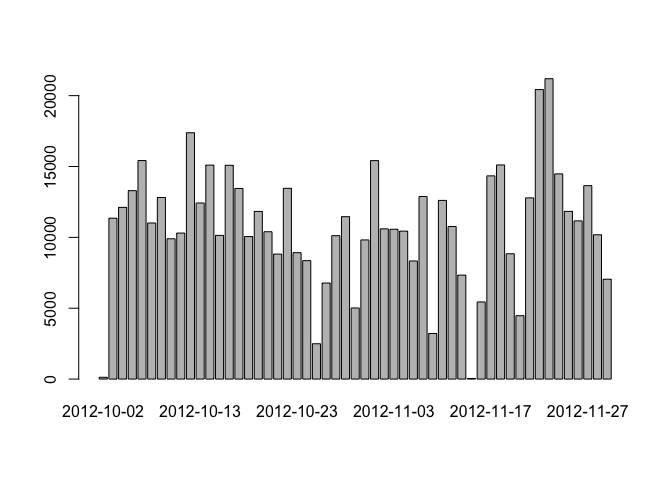
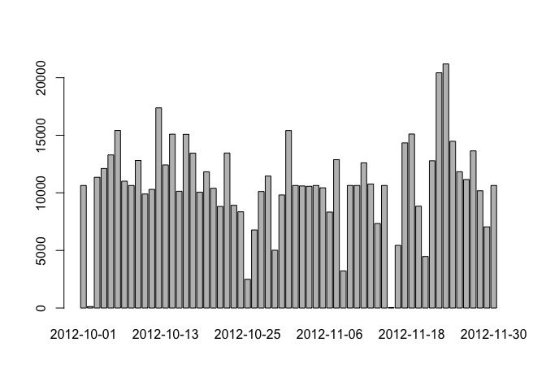

# Reproducible Research: Peer Assessment 1


## Loading and preprocessing the data

Load the data, and ensure that dates are correctly loaded as dates. By default, they will be loaded as strings.


```r
rm(list = ls())
activity <- read.csv("./activity.csv", stringsAsFactors = FALSE)
activity$date <- as.Date(activity$date)
```

## What is mean total number of steps taken per day?

### 1. Create a histogram of the total number of steps taken each day.


```r
steps_per_day <- aggregate(steps ~ date, data = activity, FUN = sum)
barplot(steps_per_day$steps, names.arg = steps_per_day$date)
```

<!-- -->

### 2. Calculate and report the mean and median total number of steps taken per day


```r
mean(steps_per_day$steps)
```

```
## [1] 10766.19
```

```r
median(steps_per_day$steps)
```

```
## [1] 10765
```

## What is the average daily activity pattern?

Create a data set for steps by interval.


```r
steps_by_interval <- aggregate(steps ~ interval, data = activity, FUN = mean)
```

### 3. Make a time series plot (i.e. type = "l") of the 5-minute interval (x-axis) and the average number of steps taken, averaged across all days (y-axis)


```r
plot(steps_by_interval$interval, steps_by_interval$steps, type = "l", 
     xlab = "Interval", ylab = "Avg. Steps by Interval")
```

<!-- -->

### 4. Which 5-minute interval, on average across all the days in the dataset, contains the maximum number of steps?


```r
steps_by_interval$interval[which.max(steps_by_interval$steps)]
```

```
## [1] 835
```

## Imputing missing values

*Note that there are a number of days/intervals where there are missing values (coded as NA). The presence of missing days may introduce bias into some calculations or summaries of the data.*

### 5. Calculate and report the total number of missing values in the dataset (i.e. the total number of rows with NAs)


```r
sum(is.na(activity$steps))
```

```
## [1] 2304
```

### 6. Devise a strategy for filling in all of the missing values in the dataset. 

The strategy does not need to be sophisticated. For example, you could use the mean/median for that day, or the mean for that 5-minute interval, etc.

The mean for each interval is already computed, so let's reuse that value. If the value is `NA`, then replace the `NA` with the mean.


```r
activity2 <- merge(activity, steps_by_interval, 
                    by = "interval", suffixes = c("", ".y"))
activity2$steps[is.na(activity2$steps)] <- floor(activity2$steps.y[is.na(activity2$steps)])
```

Confirm that we no longer have `NA` values.


```r
sum(is.na(activity2$steps))
```

```
## [1] 0
```

### 7. Create a new dataset that is equal to the original dataset but with the missing data filled in.

This was completed in the above step.

### 8. Make a histogram of the total number of steps taken each day and Calculate and report the mean and median total number of steps taken per day. 


```r
steps_per_day2 <- aggregate(steps ~ date, data = activity2, FUN = sum)
barplot(steps_per_day2$steps, names.arg = steps_per_day2$date)
```

<!-- -->

```r
mean(steps_per_day2$steps)
```

```
## [1] 10749.77
```

```r
median(steps_per_day2$steps)
```

```
## [1] 10641
```

*Do these values differ from the estimates from the first part of the assignment? What is the impact of imputing missing data on the estimates of the total daily number of steps?*

Both the mean and median are slightly lower when using an imputed mean, instead of `NA`.
